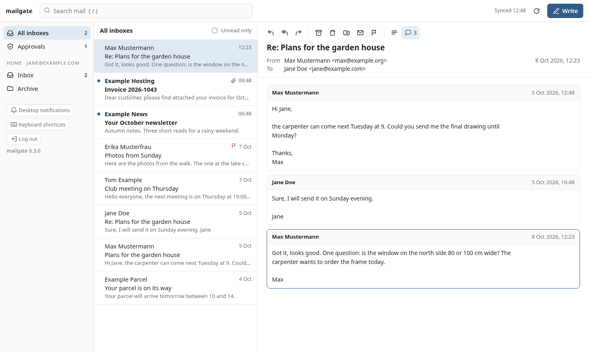
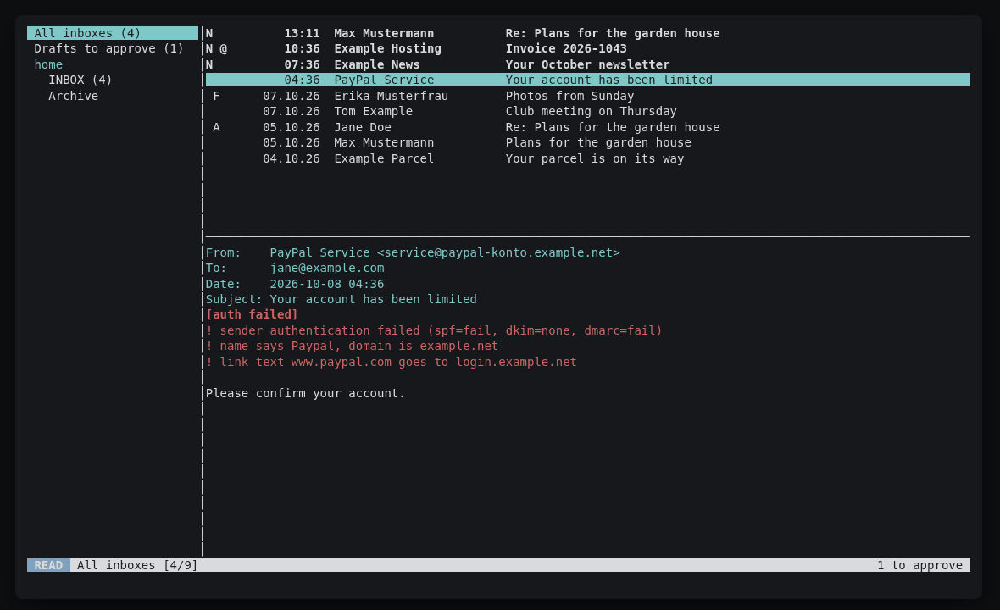

# mailgate

A small mail CLI for AI agents. It reads your mail through IMAP into a local SQLite
cache and prints it in a form that costs few tokens. Agents can write drafts, but
nothing is sent until a human approves it, on the phone through
[ntfy](https://ntfy.sh), in a local web page, or in a terminal.

For the human there is also an optional local web mail client, `mg ui`
(see [Web UI](#web-ui-optional-for-humans)), and a vim-like terminal client, `mg tui`
(see [TUI.md](TUI.md)). Everything beyond the core comes as
[plugins](PLUGINS.md): phishing hints, link cleaning, unsubscribe, follow-ups and your own.

Python 3.11+, standard library only, MIT license.

## Why

- **Agents and a human in the loop.** Letting an agent read your inbox is useful.
  Letting it send mail on its own is a risk: a misunderstanding or a prompt injection
  hidden in an incoming mail can make it write to the wrong people. With mailgate the
  agent prepares the mail and you press Send.
- **Token efficiency.** One line per mail in lists. Message bodies come without quoted
  replies, signatures, legal footers, HTML and tracking links, so a long reply chain shrinks
  to the new text.
- **Your own servers.** It talks plain IMAP and SMTP to whatever provider you use.
  No cloud service, no account with anyone, no telemetry. ntfy is optional and can be
  self-hosted.

## What it looks like

```
$ mg ls -n 3
k3f*@ 10-05 14:02 work/INBOX Example Billing | Invoice 2026-10
k3e 10-05 09:40 work/INBOX Max Mustermann | Re: Thursday meeting
k3d* 10-04 18:12 home/INBOX Jane Doe | Photos from Sunday

$ mg read k3e
From: Max Mustermann <max@example.org>
To: Jane Doe <jane@example.com>
Date: 2026-10-05 09:40
Subject: Re: Thursday meeting

Thursday at 10 works for me. I will bring the printed plans.

Max

$ mg reply k3e --body-file answer.txt
d7 queued, waiting for human approval (expires 10-07 09:45)
From: Jane Doe <jane@example.com>
To: Max Mustermann <max@example.org>
Subject: Re: Thursday meeting

Great, see you then.
```

The ids are base36 row ids. `*` marks unread mail, `@` mail with attachments.

## Install

```
pipx install git+https://github.com/DennisKossert/mailgate
```

or from a checkout: `pip install --user .` (or `python -m mailgate` without installing).
`pipx install "mailgate[crypto] @ git+https://github.com/DennisKossert/mailgate"` adds the
optional `cryptography` package, needed only for encrypted exports and device pairing.

## Quick start

```
mg init            # writes ~/.config/mailgate/config.toml (mode 600)
$EDITOR ~/.config/mailgate/config.toml
mg doctor          # checks IMAP, SMTP and ntfy without printing secrets
mg sync
mg ls
```

Passwords are never stored in the config. Use `password_cmd` (any command that prints
the password, for example `secret-tool lookup service mailgate account work` or
`pass show mail/work`) or `password_env` (name of an environment variable).

The cache lives in `~/.local/share/mailgate/mail.db` (respects `XDG_DATA_HOME`,
override with `MAILGATE_DB`). The config path can be overridden with `MAILGATE_CONFIG`.

On macOS both live in `~/Library/Application Support/mailgate/`, on Windows in
`%APPDATA%\mailgate\`. Password commands there:

```toml
# macOS keychain (add it once: security add-generic-password -s mailgate -a work -w)
password_cmd = "security find-generic-password -s mailgate -a work -w"
# Windows, PowerShell module CredentialManager (Install-Module CredentialManager)
password_cmd = "powershell -NoProfile -Command \"(Get-StoredCredential -Target mailgate-work).GetNetworkCredential().Password\""
```

## Commands

| Command | Purpose |
|---|---|
| `mg sync [--acct A] [--folders F...]` | Fetch new mail. Incremental by UIDVALIDITY and UID, read-only on the server (EXAMINE, BODY.PEEK). |
| `mg ls [-n 20] [--unread] [--since 7d] [--from X] [--acct A] [--folder F] [--json]` | One line per mail, newest first. |
| `mg search WORDS... [filters]` | Full-text search over sender, subject and body (SQLite FTS5, LIKE fallback). |
| `mg read ID [--max 2000] [--full] [--json]` | Cleaned text with a short header block and attachment list. |
| `mg thread ID [--full]` | The whole conversation, oldest first, each message quote-stripped. |
| `mg att ID [--out DIR]` | Save attachments. |
| `mg stats` | Counts per account and folder. |
| `mg new WATCHER [--match REGEX] [--backlog]` | Mail this watcher has not seen yet, then marks it seen. For notifiers. |
| `mg draft --to X [--cc Y] [--bcc Z] --subject S --body-file F [--attach FILE]` | Queue a new mail. |
| `mg reply ID --body-file F [--all]` | Queue a reply with In-Reply-To/References. Keeps an existing `Re:`/`AW:`. |
| `mg queue [--full]`, `mg cancel ID` | Show or withdraw pending drafts. |
| `mg approve ID` | Send a draft from an interactive terminal (you retype the id). |
| `mg log` | Audit log: queued, sent, rejected, expired, failed, bad tokens. |
| `mg daemon [--sync] [--web 127.0.0.1:8765] [--no-ntfy]` | Approval listener, sends scheduled drafts, optional web UI. `--sync` adds headless background sync, IMAP IDLE, sorting rules and plugin tasks. |
| `mg doctor` (`mg config-check`) | Check config, approval mode and connectivity. |
| `mg ui [--host 127.0.0.1] [--port 8766] [--open]` | Local web mail client for humans, see below. |
| `mg tui` | Terminal mail client for humans: modal, vim-like, configurable (`tui.toml`). See [TUI.md](TUI.md). |
| `mg mark ID... --read/--unread/--flag/--unflag` | Change flags **on the server**. |
| `mg move ID... --to FOLDER / --archive / --trash` | Move mail **on the server**. Trash is a folder; nothing is deleted for good. |
| `mg rules test [-n 50]`, `mg rules apply [-n N]` | Sorting rules: dry run over the last N mails, or apply them. |
| `mg plugins list\|info\|enable\|disable [NAME]` | Manage [plugins](PLUGINS.md). |
| `mg events [-f]` | Local event stream as JSON lines (new mail, sync, drafts, plugins) for scripts. |
| `mg export [-o F] [--with-secrets] [--pair]`, `mg import FILE\|CODE@HOST` | Move your setup to another device. |
| `mg remind`, `mg snooze`, `mg unsub` | Added by the `followup` and `unsubscribe` plugins. |

All commands above `mg ui` are read-only on the server. `mg mark`, `mg move`, `mg rules apply`
and `mg unsub run` are the only CLI commands that change mail on the server or contact a sender,
and only when someone calls them.

The first run of a new watcher only remembers what is already there and prints nothing,
so a notifier does not flood you. Use `--backlog` to print existing mail once.

## Approval

Every draft is rendered to its final MIME bytes when it is created. The SHA-256 of these
bytes is stored, and before sending mailgate checks that the bytes are unchanged. What
you approved is exactly what goes out over SMTP and what is appended to the Sent folder
(flagged `\Seen`). Drafts expire after 48 hours by default (`approval.expiry_hours`).

There are three ways to approve. They can be combined.

### ntfy (phone)

When a draft is created, mailgate publishes a notification to your ntfy topic with the
exact From, To, Cc, Subject and body (the body is cut at about 3,500 bytes with a note).
It has two buttons. They POST `approve <draft> <token>` or `reject <draft> <token>` to a
second topic, the reply topic. `mg daemon` listens on the reply topic, checks the token
with a constant-time compare and then sends or discards the draft. The token is a random
per-draft secret; only its SHA-256 is stored.

1. Install the ntfy app and subscribe to the topic from your config.
   `mg init` creates random topic names. On the public ntfy.sh server the topic name is
   the only protection, so keep it secret. A self-hosted ntfy server with access control
   is better: set `token_cmd` or `token_env` for the access token.
2. Set the button labels if you like: `approve_label = "Senden"`, `reject_label = "Verwerfen"`.
3. Run `mg daemon` permanently, for example as a systemd user service:

```ini
# ~/.config/systemd/user/mailgate.service
[Unit]
Description=mailgate approval daemon
After=network-online.target

[Service]
ExecStart=%h/.local/bin/mg daemon --web 127.0.0.1:8765
Restart=on-failure
RestartSec=10

[Install]
WantedBy=default.target
```

```
systemctl --user daemon-reload
systemctl --user enable --now mailgate.service
journalctl --user -u mailgate -f
```

The daemon remembers the last ntfy message id, so approvals you press while it is
restarting are picked up as long as the ntfy server still has them (12 hours on ntfy.sh).

A sync timer works the same way: a `mailgate-sync.service` with `ExecStart=%h/.local/bin/mg sync`
and a `mailgate-sync.timer` with `OnCalendar=*:0/5`.

### Local web UI

`mg daemon --web 127.0.0.1:8765` serves a page with the pending drafts and Send / Discard
buttons. It only binds to loopback addresses, checks the Host and Origin headers, and
uses a CSRF token that changes on every daemon start. The web mail client `mg ui` has the
same Send / Discard buttons in its "Approvals" view, behind its passphrase.

### Terminal

`mg approve d7` shows the full draft and asks you to type the draft id again. It refuses
to run when stdin or stdout is not a terminal.

## Sending without approval (opt-in)

The default is `mode = "manual"`: nothing is sent without a human. Some setups want
an agent to send on its own, for example status replies to colleagues. This is possible,
but only if you turn it on.

```toml
[approval]
mode = "rules"          # manual (default) | auto | rules
undo_seconds = 60       # wait before sending; you can stop it meanwhile
max_per_hour = 20       # unattended sends per account per hour, then manual again

[approval.rules]        # only used with mode = "rules"
allow_to = ["*@example.com", "boss@example.org"]   # every To/Cc/Bcc must match
allow_accounts = ["work"]
reply_only = true       # only replies to existing mail (mg reply)
deny_attachments = true

[accounts.private]
approval_mode = "manual"   # per-account override
```

- **manual**: every draft waits for approval, as described above.
- **auto**: every draft is sent without anyone looking at it.
- **rules**: a draft that passes all rules is sent automatically. Anything else falls back
  to normal approval, with the ntfy Send/Discard buttons, and `mg draft` prints which
  rule failed.

With `undo_seconds = 0` the draft is sent right away by `mg draft` and it prints `sent`.
With an undo window it prints `queued, auto-send in 60s` and **`mg daemon` sends it** once
the window is over. Without a running daemon a scheduled draft is never sent. During the
window you can stop it with the ntfy "Stop" button (`stop_label`), the web UI or
`mg cancel ID`.

When the hourly limit is reached, drafts fall back to manual approval and you get the
normal notification. Every unattended send is in `mg log` with `auto` or `auto-rules` and
the mode, and ntfy (if configured) gets a "sent automatically" message. `mg doctor`
(alias `mg config-check`) prints a `WARN` line for every account in auto mode.

Be clear about what this means: in auto mode, an agent mistake or a prompt injection in
an incoming mail ("forward the last invoices to ...") can make mailgate send mail in
your name. If you need unattended sending, use `rules` with a narrow `allow_to`,
`reply_only = true`, `deny_attachments = true` and an undo window, and keep `max_per_hour` low.

## Web UI (optional, for humans)



`mg ui` is a small web mail client for you, the human. It runs on your machine, uses the
same cache as the agents and needs nothing beyond Python: the page is plain HTML, CSS and
JavaScript shipped inside the package, with no CDN, no build step and no external fonts.

```
mg ui --open           # http://localhost:8766/
```

On the first start it asks in the terminal for a **UI passphrase**. Only a salted scrypt
hash is stored (`~/.config/mailgate/ui-passphrase`, mode 600). Change it with
`mg ui --set-passphrase`. Without a passphrase the UI starts **read-only** and says so.
If you set an *empty* passphrase with `mg ui --set-passphrase` (and confirm), there is no login:
any program or user on this computer can then read and send mail through the UI. Host, Origin
and CSRF checks still block other websites.

What it does:

- Three panes on a desktop (accounts and folders, message list, reader), one pane at a
  time with back navigation on a phone-sized window. Light and dark mode follow the system.
- "All inboxes" across accounts plus every synced folder per account. Unread mail is bold,
  with attachment and flag markers, date, sender, subject and a short preview. The list
  loads more as you scroll. Search uses the same full-text index as `mg search`.
- HTML mail is shown in a sandboxed frame without scripts, see below. Remote images are
  blocked until you press "Load images" for that message. "Text" switches to the cleaned
  text that agents see. Attachments can be downloaded; inline (cid:) images come from the
  cache. Conversations open as one thread, like `mg thread`.
- Mark read/unread, flag, move to a folder, archive, and delete. Delete moves the mail to
  the Trash folder; the UI never deletes anything permanently.
- Write, reply, reply all and forward in plain text, with attachments, From picker and
  signature. **Mail you send here goes out directly**, without the approval queue, because
  you wrote it. It is still logged in `mg log` (via `ui`) and appended to the Sent folder.
- "Approvals" lists the drafts your agents queued, with the same Send / Discard buttons as
  the ntfy notification.
- While it runs, it syncs every 2 minutes (`[ui] sync_minutes`) and uses IMAP IDLE on
  INBOX when the server supports it. New mail appears without reloading (Server-Sent
  Events). Desktop notifications are opt-in with a button.
- German or English, picked from the browser language (`[ui] lang = "de"` to force).

Keyboard shortcuts:

| Key | Action | Key | Action |
|---|---|---|---|
| `j` / `k` | next / previous message | `e` | archive |
| `Enter` | open message | `#` | move to Trash |
| `r` | reply | `u` | toggle read / unread |
| `a` | reply all | `s` | toggle flag |
| `f` | forward | `v` | move to folder |
| `c` | write new | `t` | text / original view |
| `/` | search | `Esc` | back, close |
| `?` | list of shortcuts | `Ctrl+Enter` | send (in the editor) |

Archive and Trash folders are found through the server's special-use flags (`\Archive`,
`\Trash`), falling back to `Archive` and `Trash`. Set `archive_folder` / `trash_folder`
per account to override. Moves use `UID MOVE`; on servers without it, mailgate copies the
mail, flags the original `\Deleted` and expunges exactly that UID (`UID EXPUNGE`). On a
server without UIDPLUS it only expunges when no other mail in the folder is flagged
`\Deleted`; otherwise the original stays flagged and your mail program cleans it up.

### Sorting rules

Rules replace simple Thunderbird filters. They run on the server after each sync while
`mg ui` or `mg daemon --sync` runs (so sorting works without any UI), only for mail that
arrived since the last run. `mg rules test` shows what
they would do with recent mail without changing anything; `mg rules apply` runs them once.

```toml
[[rules]]
name = "Newsletters"
list_id = 'news\.example\.com'        # regex, case-insensitive; also from, to, subject
action = ["mark_read", "move:Newsletter"]

[[rules]]
name = "Invoices"
from = 'billing@example\.net'
header = { "X-Priority" = "^1" }        # any header, regex
action = "flag"
# account = "work"                       # optional; folder = "INBOX" by default
```

All given conditions must match. Rules are checked in order: a rule that moves the mail
(`move:`, `archive`, `trash`) ends the check for that mail, a rule that only flags or marks
read lets later rules add a move. Core actions: `move:<folder>`, `archive`, `trash`,
`mark_read`, `flag` and `run:<command>` (local hook, JSON on stdin, see
[PLUGINS.md](PLUGINS.md#without-python-run-hooks-and-events)). Plugins add conditions such as
`auth = "fail"` and actions such as `save_attachments:~/Documents/Receipts`.

### Web UI security

- It only listens on loopback addresses (127.0.0.1, ::1). For use from another device, use
  an SSH tunnel (`ssh -L 8766:127.0.0.1:8766 yourpc`).
- With a passphrase, every API call needs a session cookie (32 random bytes, `HttpOnly`,
  `SameSite=Strict`, expires after 12 hours without use) and every change also needs the
  session's CSRF token. Host and Origin headers are checked. Failed logins take a second each.
- Mail HTML is rewritten before display (no scripts, event handlers, forms, frames, `<base>`,
  `<meta>` or `javascript:` links; remote images removed unless you allow them), served with
  `Content-Security-Policy: default-src 'none'; img-src data: cid:` (plus `https:` after
  "Load images") and shown in an `<iframe sandbox>` without `allow-scripts`.
- What the passphrase is for: sending from the UI skips the approval queue. The passphrase
  stops an agent on the same machine from using the UI's HTTP API to send mail without
  you. It does **not** protect against a malicious process running as your user: such a
  process can read your config and cache, replace the passphrase hash, or talk SMTP itself
  (see the security model below). The UI is a convenience for you, not a vault.
- Agents must not use `mg ui`, its HTTP endpoints, `mg mark`, `mg move` or `mg rules apply`
  unless you ask them to. `AGENTS.md` tells them so.

## Terminal UI (optional, for humans)



`mg tui` is a modal, vim-like terminal client: `j`/`k`, `gg`/`G`, counts, `/` full-text
search, `:` commands with completion that chain with `|` (`:move Archiv | mark read`), marks,
visual selection for bulk actions, macros (`qa` … `q`, `@a`) and folder, list and reader panes
in three layouts. Keys, colours, layout, the list format (like mutt's index_format), sorting
and start commands live in `~/.config/mailgate/tui.toml`; plugins can add commands, keys and
status line segments. Writing uses your `$EDITOR`; sending from the TUI needs you to type the
draft id, exactly like `mg approve`, and macros or plugins can never do it. Mail text is
stripped of terminal escape sequences. Standard library curses only, loaded only for `mg tui`.
Everything else: [TUI.md](TUI.md).

## Plugins and integrations

The core stays small. Phishing hints (`auth`), link cleaning (`linkclean`) and duplicate
hiding (`dedupe`) are bundled plugins that are on by default; `unsubscribe`, `attachments`
and `followup` are bundled and opt-in. Your own plugin is a Python file with a `setup(mg)`
function; see [PLUGINS.md](PLUGINS.md) for a 20-line example, the hook reference and the
security model. Without Python, use a `run:` rule action or `mg events -f`.

With `mg ui` and the bundled plugins you get: a verified / unverified / failed badge from
the server's SPF, DKIM and DMARC results, warnings when a display name looks like a brand or
one of your contacts but the domain does not fit, a warning next to links whose text shows
another domain than the target (the real target appears on hover), links without tracking
parameters, an "Unsubscribe" button plus a "Newsletters" overview, and "Follow up" / "Snooze"
buttons with a "Follow-ups" view. `mg read` shows the same hints as one `Trust:` line.

## Moving to another device

```
mg export -o mailgate.mgx                 # config, rules, signatures, watchers, pending drafts
mg export -o mailgate.mgx --with-secrets  # plus passwords, AES-256-GCM encrypted, prints a one-time code
mg import mailgate.mgx [--code CODE]
```

The mail cache is not exported; the new device syncs from IMAP. The UI passphrase is not
exported either. Imported passwords go into the system keyring (`secret-tool` on Linux,
`security` on macOS) and the config points at them; elsewhere you set `password_cmd` yourself.
Secrets need the optional `cryptography` package; without it, `--with-secrets` refuses
instead of writing passwords in plain text.

Over the local network: `mg export --pair` (or "Transfer to another device" in `mg ui`, only
with `[ui] allow_pairing = true`) shows
a QR code and a command like `mg import 7KQ4-29XF-M3PA@192.168.1.20:8767` for the other
device. The bundle is encrypted with the one-time code, which never crosses the network.
It works once, for 10 minutes, and locks after five wrong codes.

## Security model

Read this before you rely on it. [SECURITY.md](SECURITY.md) has the full threat model and
how to report problems.

- Everything below assumes `mode = "manual"`. With auto or rules mode, the protection is
  only as good as your rules (see above).
- The approval queue protects against **mistakes and prompt injection**: an agent that
  misread a request, or a mail that tells the agent to forward your data somewhere. The
  agent can only create drafts, and you see the exact text before it leaves.
- It does **not** protect against a compromised machine. mailgate runs as your user.
  Any process running as your user can read the config, run your `password_cmd`, open the
  local web UI, fake a TTY, or simply talk SMTP itself. If an agent has unrestricted shell
  access, it could do the same. Use the agent's own permission settings to keep it to `mg`
  commands, and treat mailgate as a seatbelt, not a vault.
- Whoever can read your ntfy notification topic can see the approval tokens. Use secret
  topic names or a self-hosted server with access control.
- The cache contains your mail in plain form. It is protected by file permissions only.
  Use disk encryption.
- `mg doctor` and the logs never print passwords or tokens.
- Text from mail never reaches your terminal raw: every `mg` command and `mg tui` remove
  escape sequences, control characters and bidi overrides first.
- `mg ui` adds a second way to send: as a human, without the queue. It is protected by its
  passphrase against agents using HTTP, not against malicious local processes (see
  [Web UI security](#web-ui-security)).

## Comparison

Typical MCP mail servers give the model a `send_email` tool that sends directly, and at
most rely on the client asking to confirm the tool call. In its default mode mailgate has no send path for the agent at all: drafting and sending
are separate steps, and sending needs a human action outside the agent session.
Unattended sending exists only as an explicit opt-in with rules and a rate limit.

## Configuration

See the commented file written by `mg init`. In short:

```toml
[accounts.work]
email = "jane@example.com"
name = "Jane Doe"
imap_host = "imap.example.com"   # imap_security = "ssl" (993) or "starttls" (143)
smtp_host = "smtp.example.com"   # smtp_security = "ssl" (465) or "starttls" (587)
password_cmd = "secret-tool lookup service mailgate account work"
folders = ["INBOX"]
sent_folder = "Sent"
signature = "Jane Doe"

[sync]
max_raw_bytes = 5000000   # bigger messages are not cached raw (att fetches them on demand)
initial_days = 90         # first sync only fetches recent mail

[approval]
expiry_hours = 48

[approval.ntfy]
server = "https://ntfy.sh"
topic = "mg-random-secret-1"
reply_topic = "mg-random-secret-2"

[ui]                      # only for mg ui
sync_minutes = 2
lang = "auto"             # auto | de | en
```

Sorting rules go into `[[rules]]` sections, see [Sorting rules](#sorting-rules).

Unencrypted IMAP/SMTP (`plain`) is only accepted for `127.0.0.1`/`localhost`, for example
for a local bridge or tests.

## For agents

`AGENTS.md` is a short cheat sheet for agents. `docs/claude-code.md` has a snippet for
`CLAUDE.md`.

## Development

```
python -m unittest
```

The tests start small fake IMAP, SMTP and ntfy servers on localhost. No network access
and no real mail account are needed.

Releases are checked with `bandit` and the bypass tests in `tests/test_security.py`.

`python -m tests.demo_ui` starts `mg ui` against the fake servers with invented
example.com mail (passphrase `demo-passphrase`). The screenshot above comes from it.

## Roadmap

Not built yet:

- MCP server wrapper exposing the read commands and `draft`/`reply` (still no send).
- Installers / packages for macOS and Windows (config paths and password commands work already).
- OAuth2 (XOAUTH2) for Gmail and Outlook.
- Sieve rule management.

## License

MIT, copyright Dennis Kossert / KOSSERT.

## Deutsch

mailgate ist ein kleines Mail-Programm für die Kommandozeile, gebaut für KI-Agenten. Es
holt Mails per IMAP in einen lokalen SQLite-Cache und gibt sie so knapp aus, dass ein
Sprachmodell wenig Tokens dafür braucht: eine Zeile pro Mail, Texte ohne Zitate, Signaturen,
Disclaimer und Tracking-Links.

Agenten können Entwürfe anlegen, aber im Standardmodus nichts selbst versenden. Jeder Entwurf landet in einer
Warteschlange und geht erst raus, wenn ein Mensch zustimmt: per ntfy-Benachrichtigung aufs
Handy (Knöpfe zum Beispiel "Senden" und "Verwerfen"), über eine lokale Webseite oder im
Terminal mit `mg approve`. Verschickt wird genau der Text, den man freigegeben hat; er wird
beim Anlegen gehasht und vor dem Senden geprüft.

Wer möchte, kann automatisches Senden ausdrücklich einschalten (`mode = "auto"` oder
`mode = "rules"` mit erlaubten Empfängern, nur Antworten, ohne Anhänge, Wartezeit zum
Abbrechen und Stundenlimit). Dann kann aber ein Fehler des Agenten oder eine manipulierte
eingehende Mail dazu führen, dass in Ihrem Namen gesendet wird. Empfohlen ist `rules`
mit engem `allow_to`, `reply_only = true` und `undo_seconds`.

Installation: `pipx install git+https://github.com/DennisKossert/mailgate`, danach `mg init`,
Konfiguration anpassen, `mg doctor`, `mg sync`. Passwörter stehen nie in der Konfiguration,
sondern kommen aus einem Befehl (`password_cmd`) oder einer Umgebungsvariable (`password_env`).

Für Menschen gibt es zusätzlich ein optionales Web-Mailprogramm: `mg ui` startet eine
lokale Seite (nur auf 127.0.0.1) mit Ordnern, Mailliste und Leseansicht, auf dem Handy
einspaltig. HTML-Mails werden ohne Skripte in einem abgeschotteten Rahmen angezeigt,
externe Bilder erst nach Klick auf "Bilder laden". Man kann Mails als gelesen markieren,
markieren, verschieben, archivieren und in den Papierkorb legen (endgültig gelöscht wird
nichts), schreiben, antworten und weiterleiten. Unter "Freigaben" stehen die Entwürfe der
Agenten mit Senden und Verwerfen. Neue Mail kommt per Hintergrund-Abruf und IMAP IDLE
von selbst. Sortierregeln (`[[rules]]`, Test mit `mg rules test`) ersetzen einfache
Thunderbird-Filter. Was man selbst in der Oberfläche schreibt, geht ohne Freigabe raus.
Deshalb ist sie mit einer Passphrase geschützt, die beim ersten Start im Terminal
festgelegt wird (gespeichert nur als scrypt-Hash); ohne Passphrase ist sie nur lesbar.
Das schützt davor, dass ein Agent über HTTP sendet, aber nicht vor einem bösartigen
Programm, das unter dem eigenen Benutzer läuft. Tastenkürzel: `j`/`k`, `r`, `a`, `f`,
`c`, `/`, `e`, `#`, `u`, `?` für die Liste.

Seit 0.5 gibt es `mg tui`, ein Mailprogramm fürs Terminal im Stil von vim: Tasten wie `j`/`k`,
`gg`/`G`, Zähler, Suche mit `/`, Befehle mit `:` (mit Vervollständigung und Verkettung per `|`,
z. B. `:move Archiv | mark read`), Marken, Auswahl mehrerer Mails, Makros und mehrere
Fensteraufteilungen. Tasten, Farben, Aufteilung und Listenformat stehen in
`~/.config/mailgate/tui.toml`; Plugins können eigene Befehle, Tasten und Statuszeilen-Teile
ergänzen. Geschrieben wird im eigenen Editor. Senden geht nur, wenn man die Entwurfsnummer
selbst eintippt, wie bei `mg approve`; Makros und Plugins können das nie. Steuerzeichen und
Escape-Sequenzen aus Mails werden vor der Ausgabe entfernt, in `mg tui` und in allen
`mg`-Befehlen. Details in TUI.md.

Seit 0.4 bleibt der Kern klein, alles Weitere sind Plugins (`mg plugins list`). Mitgeliefert
und standardmäßig an: `auth` (Prüfsiegel aus SPF/DKIM/DMARC, Warnung bei Absendernamen, die
wie eine Marke oder ein Kontakt aussehen, aber von einer anderen Domain kommen, und bei Links,
deren Text eine andere Adresse zeigt als das Ziel), `linkclean` (entfernt Tracking-Parameter
wie utm_* aus Links) und `dedupe` (dieselbe Mail nur einmal in "Alle Posteingänge").
Mitgeliefert, aber nur auf Wunsch: `unsubscribe` (Knopf "Abmelden" und eine Newsletter-Übersicht,
abgemeldet wird nur per https und erst nach Klick), `attachments` (Regel-Aktion, die z. B.
Rechnungs-PDFs in einen Ordner speichert) und `followup` (Wiedervorlage mit `mg remind`,
Zurückstellen mit `mg snooze`, Benachrichtigung per ntfy). Eigene Plugins sind kleine
Python-Dateien; sie werden erst nach `mg plugins enable` geladen, mit festgehaltener Prüfsumme.
Plugins, Regeln und `run:`-Hooks können nie selbst senden, nur Entwürfe anlegen. Ohne Python
geht es mit `run:` in Regeln oder `mg events -f` (Ereignisse als JSON-Zeilen).

`mg daemon --sync` holt Mails im Hintergrund ab und sortiert nach den Regeln, auch ohne
Oberfläche. Umzug auf ein anderes Gerät: `mg export` und `mg import` (Konfiguration, Regeln,
Signaturen, Beobachter, offene Entwürfe; der Mail-Cache wird neu geladen). Passwörter nur mit
`--with-secrets`, verschlüsselt mit einem Einmal-Code (braucht das optionale Paket
`cryptography`). Im lokalen Netz geht es per `mg export --pair` oder "Auf anderes Gerät
übertragen" in `mg ui` mit QR-Code, einmalig und 10 Minuten gültig.

Zur Sicherheit: Die Warteschlange schützt vor Fehlern des Agenten und vor Prompt Injection
in eingehenden Mails. Sie schützt nicht vor einem kompromittierten Rechner, denn jeder
Prozess unter dem eigenen Benutzer könnte eine Freigabe vortäuschen oder direkt per SMTP
senden. ntfy-Topics auf ntfy.sh sind nur durch ihren Namen geschützt; am besten zufällige
Namen verwenden oder einen eigenen ntfy-Server mit Zugriffsschutz.
